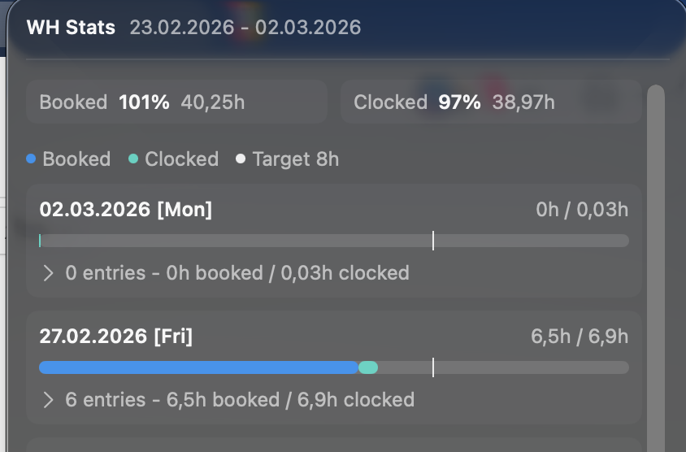

# whstats-bar

Minimal macOS menu bar app that executes:

```bash
bun x whstats --json
```

and renders the returned stats in a menu bar popup.



## Requirements

- macOS 26+
- Xcode 15+ (or Swift 6.2 toolchain)
- Bun installed (`bun --version`)
- [WHStats](https://github.com/emmertarmin/whstats) configured

## Installation

Build and install the `.app` bundle:

```bash
./scripts/build-app.sh
cp -R dist/WHStatsBar.app /Applications/
```